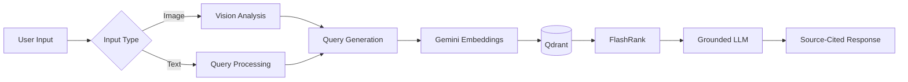
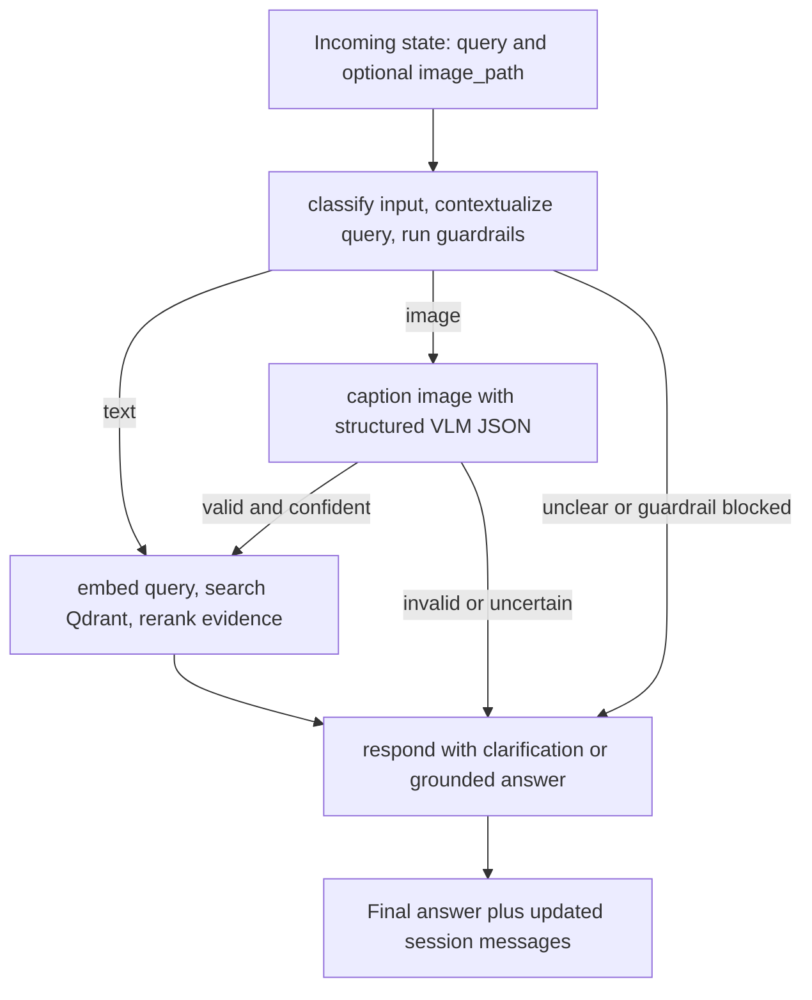

# 🌱 AgriVision — Multi‑Modal Agricultural Intelligence


**A multimodal AI assistant that combines Computer Vision, Retrieval‑Augmented Generation (RAG), and LangGraph orchestration to deliver grounded, source‑cited agricultural guidance.**

[](https://www.python.org/)
[](https://fastapi.tiangolo.com/)
[](https://www.langchain.com/langgraph)
[]()
[]()
[](https://qdrant.tech/)
[]()
[](https://groq.com/)
[](https://ai.google.dev/)
[](https://gradio.app/)
[](LICENSE)
---

## Overview

AgriVision is a multimodal AI assistant that combines computer vision, Retrieval‑Augmented Generation (RAG), and LangGraph orchestration to provide grounded, source‑cited agricultural guidance from crop images and natural‑language questions.

The system integrates a vision‑capable LLM, vector retrieval, reranking, conversational memory, and safety guardrails to reduce hallucinations while producing practical, evidence‑backed responses.

---
## Features

- 📷 Vision-based crop disease detection
- 📚 Retrieval-Augmented Generation (RAG)
- 🧠 LangGraph workflow orchestration
- 💬 Thread-scoped conversation memory
- 🔎 FlashRank reranking
- 📖 Source-cited responses
- ⚡ FastAPI REST API
- 🌐 Gradio web interface

## Key highlights

| Feature | Notes |
|---|---|
| Multi‑modal | Image + text inputs; structured VLM outputs |
| RAG + Rerank | Retrieval (Qdrant) + FlashRank cross‑encoder |
| Session memory | Thread-scoped LangGraph `MemorySaver`; recent messages contextualize follow-ups |
| Grounding | Synthesizer constrained to retrieved passages with citations |
| Orchestration | LangGraph node workflow (planner, detection, retrieval, responder) |

---

## Tech stack

| Area | Technology |
|---|---|
| LLM inference | Groq |
| Vision analysis | Vision‑capable LLM (ChatGroq) |
| Embeddings | Gemini embeddings (3072‑d); optional sentence‑transformers fallback |
| Vector database | Qdrant |
| Reranking | FlashRank cross‑encoder |
| Backend | Python 3.11+, FastAPI, Uvicorn |
| UI | Gradio (demo) |
| Orchestration | LangGraph (StateGraph, MessagesState) |
| Observability | Logfire, LangSmith hooks |

---

## Architecture (diagram)



---

## How it works (short)

- User provides an image or text query via Gradio/REST.
- Planner node contextualizes follow-up text with recent session messages, applies guardrails, and routes the request.
- If image: detection node validates the image and asks a vision-capable LLM for structured JSON (crop, symptoms, possible disease, confidence).
- Confident image observations are stored in `agrivision_observations` as lower-trust evidence; confident diagnoses become treatment queries.
- Retrieval node embeds the query, searches `agrivision_docs` plus prior observations, and applies FlashRank reranking.
- Synthesizer (Groq) receives the rewritten question and reranked passages, answers only from retrieved evidence, and lists sources.

---

## Folder structure (quick)

```
api/          FastAPI routes, service wrapper, and Gradio mount
graph/        LangGraph state, routing, and runtime nodes
detection/    Vision LLM captioning plus optional YOLO inference
retrieval/    Embeddings, Qdrant access, observation search, reranking, synthesis
ingestion/    PDF extraction, cleaning, chunking, and Qdrant ingestion
guardrails/   NeMo guardrails and lightweight intent filters
config/       Environment settings and observability
docs/         Deeper architecture, RAG, deployment, memory, API, and dataset notes
tests/        Guardrail tests and evaluation scaffolding
```

Full file map in repository — see detailed docs below.

---

## Example workflow

Runtime graph routing is defined in `graph/build_graph.py`:



---

## Quick start (developer)

```bash
git clone https://github.com/yourusername/agrivision.git
cd agrivision
python3 -m venv .venv
source .venv/bin/activate
pip install -r requirements.txt
```

Create `.env` with keys referenced in `config/settings.py` and run:

```bash
python -m retrieval.qdrant_client      # create collections
python -m retrieval.ingest_to_qdrant   # ingest docs
uvicorn api.app:app --port 8000
```

Open the demo: `http://localhost:8000/app`

---

## Future work

- Hybrid search (dense + BM25)
- Persistent session memory (Postgres/Redis)
- Streaming synth responses
- Deployment manifests.

---

## Documentation (details)

See `docs/` for in‑depth architecture, RAG pipeline, design decisions, and memory notes:

- [ARCHITECTURE](docs/ARCHITECTURE.md)
- [RAG_PIPELINE](docs/RAG_PIPELINE.md)
- [DESIGN_DECISIONS](docs/DESIGN_DECISIONS.md)
- [MEMORY](docs/MEMORY.md)
- [DEPLOYMENT](docs/DEPLOYMENT.md)
- [EVALUATION](docs/EVALUATION.md)
- [API](docs/API.md)
- [DATASET](docs/DATASET.md)

---

## License

MIT — add a `LICENSE` file to apply.

---
